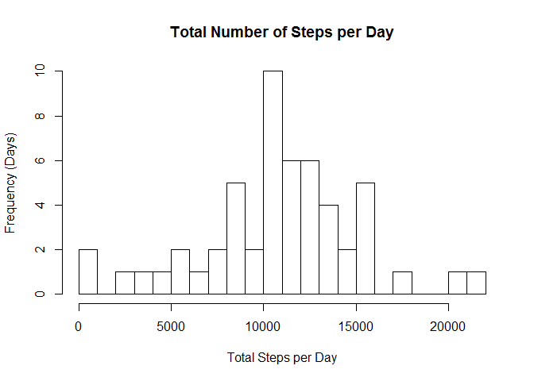
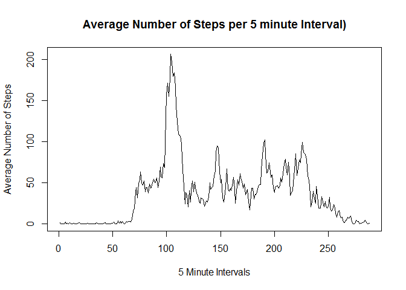
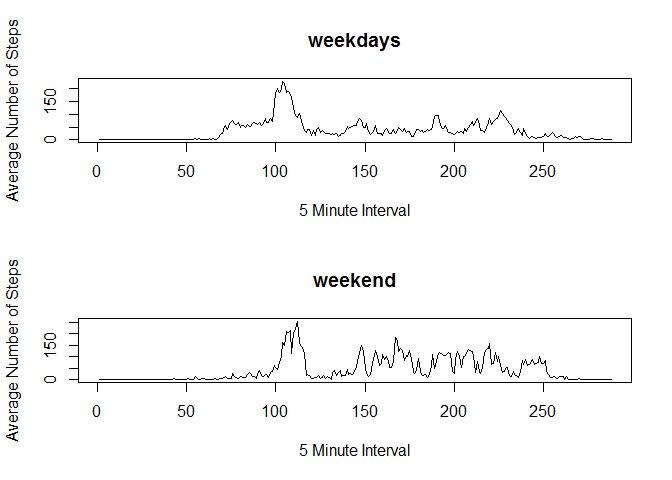

# Reproducible Research: Peer Assessment 1

## Loading and preprocessing the data  

1. Load the data:  


```r
data<- read.csv("activity.csv")
```

2. Process/transform the data into a format suitable for your analysis:  

```r
data$date <- as.Date(data$date,"%Y-%m-%d")
```

## What is the mean total number of steps taken per day?  

1. Calculate the total number of steps taken per day:  

```r
dateGroup <- factor(data$date)
StepsDay<- tapply (data$steps, dateGroup, sum)
```


2. Make a histogram of the total number of steps taken each day:  

```r
hist(StepsDay, xlab="Total Steps per Day",ylab="Frequency (Days)",main="Total Number of Steps per Day", breaks=30)
```

\

3. Calculate and report the mean and median of the total number of steps taken per day:  
Mean calculation: 

```r
StepsDayMean <- mean(StepsDay, na.rm=TRUE)
StepsDayMean
```

```
## [1] 10766.19
```
Median Calculation:  

```r
StepsDayMedian <- median(StepsDay, na.rm=TRUE)
StepsDayMedian
```

```
## [1] 10765
```

## What is the average daily activity pattern?  

1. Make a time series plot of the 5-minute interval (x-axis) and the average number of steps taken, averaged across all days (y-axis):  

```r
intervalGroup <- factor(data$interval)
StepsIntervalMean<-tapply(data$steps,intervalGroup, mean, na.rm=T)

plot(StepsIntervalMean, type="l", xlab="5 Minute Intervals", ylab="Average Number of Steps",  main="Average Number of Steps per 5 minute Interval)")
```

\

2. Which 5-minute interval, on average across all the days in the dataset, contains the maximum number of steps?  

```r
MaxInterval <- data$interval[which.max(StepsIntervalMean)]
MaxInterval
```

```
## [1] 835
```

## Imputing missing values  

1. Calculate and report the total number of missing values in the dataset:  

```r
sum(is.na(data$steps))
```

```
## [1] 2304
```

2. Create a new dataset that is equal to the original dataset but with the missing data filled in:  

```r
StepsIntervalMeanDF <- as.data.frame(StepsIntervalMean)

data2 = merge(data, StepsIntervalMeanDF, by.x="interval", by.y = "row.names")

data2$steps[is.na(data2$steps)] = data2$StepsIntervalMean[is.na(data2$steps)]
data2$date <- as.Date(data2$date,"%Y-%m-%d")

data2$StepsIntervalMean = NULL
```

3.Make a histogram of the total number of steps taken each day and calculate and report the mean and median total number of steps taken per day.  
Histogram:  

```r
StepsDaySum2 <- tapply (data2$steps, dateGroup, sum)
hist(StepsDaySum2, xlab="Total Steps by Day",ylab="Frequency (Days)",main="Number of Daily Steps", breaks=30)
```

\

Mean and Median:  

```r
StepsDayMean2 <- mean(StepsDaySum2, na.rm=TRUE)
StepsDayMean2
```

```
## [1] 10766.19
```

```r
StepsDayMedian2 <- median(StepsDaySum2, na.rm=TRUE)
StepsDayMedian2
```

```
## [1] 10351.62
```

Notice these mean value is equalivent to the first section, but the median is a different value. The impact of imputing the missing data records more zero values within the dataset.  

## Are there differences in activity patterns between weekdays and weekends?  

1. Create a new factor variable in the dataset with two levels - "weekday" and "weekend" indicating whether a given date is a weekday or weekend day.  

```r
data2$day <- weekdays(data2$date)
data2$day[data2$day == "Saturday" | data2$day == "Saturday" ] <- "weekend"
data2$day[data2$day == "Monday" | data2$day == "Tuesday" | data2$day == "Wednesday"| data2$day == "Thursday" | data2$day == "Friday" ] <- "weekday"
```

2. Make a panel plot containing a time series plot of the 5-minute interval (x-axis) and the average number of steps taken, averaged across all weekday days or weekend days (y-axis).  

```r
AverageStepsIntervalWeekday =  tapply(subset(data2, day=="weekday")$steps, subset(data2, day=="weekday")$interval, mean, na.rm=TRUE)
AverageStepsIntervalWeekend =  tapply(subset(data2, day=="weekend")$steps, subset(data2, day=="weekend")$interval, mean, na.rm=TRUE)

par(mfrow = c(2, 1))
plot(AverageStepsIntervalWeekday, type="l", xlab="5 Minute Interval", ylab="Average Number of Steps", main="weekdays")
plot(AverageStepsIntervalWeekend, type="l", xlab="5 Minute Interval", ylab="Average Number of Steps", main="weekend")
```

\
